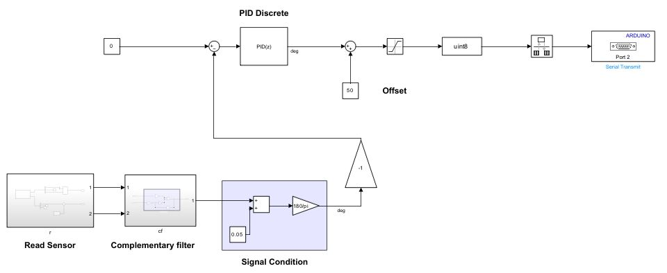

# PID Control of 1-DoF Copter Robot

This project demonstrates the implementation of PID control for stabilizing a 1-DoF (Degree of Freedom) copter robot. The system uses an IMU (MPU6050) sensor for angle detection, a complementary filter for sensor fusion, and an Arduino Due microcontroller to implement the control algorithm using Simulink.

## Project Overview

The project focuses on achieving stable flight of a 1-DoF copter by employing a PID control strategy. The copter's orientation is maintained by continuously adjusting the motor speed based on feedback from the MPU6050 sensor. The control system is designed to respond to disturbances and maintain the desired angle of the copter.

### Usage Demo
 
   

   
   
## Key Components

- **1-DoF Copter**: A simple copter model that allows for tilt control in one direction.
- **IMU (MPU6050) Sensor**: Used to measure the orientation of the copter. The MPU6050 combines a 3-axis gyroscope and a 3-axis accelerometer to provide accurate angle readings.
- **Complementary Filter**: This filter is implemented to fuse the data from the gyroscope and accelerometer, providing a stable estimate of the copter's orientation.
- **Arduino Due**: The microcontroller that processes the sensor data and executes the PID control algorithm.
- **Simulink**: A graphical programming environment used to design and simulate the control system.

## PID Control

The PID controller adjusts the copter's motor speeds based on the error between the desired and measured angles. The PID parameters (Proportional, Integral, Derivative) are tuned to achieve optimal performance, balancing responsiveness and stability.

## Simulation and Results

The system is modeled and simulated in Simulink to evaluate the performance of the PID controller. Various scenarios, including step responses and disturbance rejection, are tested to ensure the copter maintains stability.

## Conclusion

This project provides a foundational understanding of PID control in robotics, demonstrating the integration of hardware and software components for stabilizing a copter robot using Simulink and Arduino.

